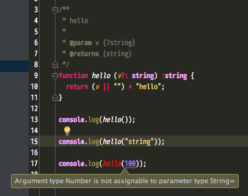
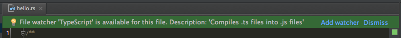
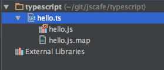

# TypeScript

型を守ってSAFEコーディング

## Agenda

* TypeScript について
* 導入する前に

## 自己紹介

てきとうに...

## TypeScriptについておさらい

###  Welcome to TypeScript
Microsoftがオープンソースとして公開している altJS の 型付け特化のコンパイラ  
じつは去年の2012年に登場していました。

割と色んな所で名前を目にする事が多く、日本語の記事もそれなりにあります  
現在 (2013-07-01の時点では) v0.9、今年は業務で使われるケースが多くなりそう。

altJS: CoffeeScriptとか

* TypeScript  
[http://www.typescriptlang.org/](http://www.typescriptlang.org/)  
[https://npmjs.org/package/typescript](https://npmjs.org/package/typescript)

* WEB DB PRESS Vol.75 に TypeScript が取り上げられています  
[http://gihyo.jp/magazine/wdpress/archive/2013/vol75](http://gihyo.jp/magazine/wdpress/archive/2013/vol75)

#### 個人的に一言
CoffeeScript のコードって結構人によって書き方違うし  
そもそもコンパイルするとコード汚いじゃん？

### 覚えてますか？2012年のWEB業界キーワード
* Github
* Pull Request
* マサカリ族
* Jenkins
* CI (継続的インテグレーション : Continuous Integration)

開発環境を見直す時期に入ってきた(導入し始めた)。

#### フロントエンドは？
* Grunt
* AngularJS
* BackboneJS
* UnderScoreJS
* Bower
* Yeoman
* CreateJS
* JavaScript Test Framework
	* Jasmine
	* JsTestDriver
	* QUnit
	* mocha
	* Testem

コードが複雑になり、それに応じて開発環境も複雑になってきた

### 今年はフロントエンドにも『型』
JavaScript の型って好いようにやってくれるじゃん？  
JavaScript の魅力ってなんでも Object なんだしゆるくていいじゃない

* 開発が複雑になり、みんなでコードに手を入れる事が多くなった
* 複雑で 1ヶ月前のコードとか覚えてないし
* 知らない人のコードを保守する事になった
* 良く分からないけどテストは通ってる
* 仕様書どこだっけ
* etc...

どうやら他人事じゃなくなってきた。

## 明日から使う為に (導入)

### IDE or Editor

#### Visual Studio 2012  
* for Windows 7
* for Windows 8

Visual Studio Express 2012 for Web  
[http://www.microsoft.com/en-us/download/details.aspx?id=34790](http://www.microsoft.com/en-us/download/details.aspx?id=34790)

#### JetBrains (おすすめ)
* WebStorm $49
* PhpStorm $99

Windows, OSX, Linux のマルチプラットフォーム  
v0.8 ちょっと古いけれど JetBrains は更新頻度が高いプロダクトなのですぐ対応する可能性が高い

#### nodejs
grunt-typescript
[https://npmjs.org/package/grunt-typescript](https://npmjs.org/package/grunt-typescript)

#### Sublime Text $70
#### Vim
nodejs のコンパイラで環境を手に入れる

* TypeScript support for Sublime Text  
TypeScript support for Emacs  
TypeScript support for Vim  
[http://blogs.msdn.com/b/interoperability/archive/2012/10/01/sublime-text-vi-emacs-typescript-enabled.aspx](http://blogs.msdn.com/b/interoperability/archive/2012/10/01/sublime-text-vi-emacs-typescript-enabled.aspx)

* [https://github.com/leafgarland/typescript-vim](https://github.com/leafgarland/typescript-vim)

## WebStorm, PhpStorm で使う
hogeStorm のアナライズ凄いです

	Demo
	* コンパイルのオプション

ts ファイルの watch 便利すぎる
watch の設定

## nodejs
	npm install -g typescript

## メリット
* CoffeeScript とは違い、普通の JavaScript の記述に近いので導入しやすい

* Visual Studio 2012 (+ TypeScript for Visual Studio 2012 アドオン)  
もしくは、JetBrains 社 の IDE WebStorm や PhpStorm でもそのまま使えます。

* CUI で作っている場合も nodejs があれば大丈夫。

* CoffeeScript の出力した 生js ファイル汚くありませんか？  
TypeScript はそんなことはありません。 

* 有名なJavaScriptライブラリ の 宣言ファイル沢山あります!  
[https://github.com/borisyankov/DefinitelyTyped](https://github.com/borisyankov/DefinitelyTyped)

## デメリット
* コードが冗長になりやすい

* JavaScript フレームワーク や、今まで作ったコード資産を導入するには手間がかかる  
=> 既存のコードは書き直してまで移行しなくても良い場面の方が多いと思います。

* 元のコードが CoffeeScript なんだけど... 諦めましょう

### TypeScript ドキュメント
[http://typescript.codeplex.com/](http://typescript.codeplex.com/)

### 参考
* TypeScript + SourceMap でデバッグしてみる  
[http://yaakaito.org/blog/2013/03/28/typescript-with-sorucemap/](http://yaakaito.org/blog/2013/03/28/typescript-with-sorucemap/)

* TypeScriptのAPIドキュメントをyuidocjsで自動生成  
[http://straitwalk.hatenablog.com/entry/2013/06/22/022909](http://straitwalk.hatenablog.com/entry/2013/06/22/022909)

* borisyankov/DefinitelyTyped  
[https://github.com/borisyankov/DefinitelyTyped](https://github.com/borisyankov/DefinitelyTyped)

## キャプチャ

## CUI options

	Version 0.9.0.1
	Syntax:   tsc [options] [file ..]

	Examples: tsc hello.ts
			  tsc --out foo.js foo.ts
			  tsc @args.txt

	Options:
	  -c, --comments              Emit comments to output
	*  -d, --declaration           Generates corresponding .d.ts file
	*  -b, --disallowbool          Throw error for use of deprecated "bool" type
	*  -m, --disallowimportmodule  Throw error for use of deprecated "module" keyword when referencing an external module. Only allow "require" keyword.
	  -e, --exec                  Execute the script after compilation
	  -h, --help                  Print this message
	  --module KIND               Specify module code generation: "commonjs" (default) or "amd"
	  --nolib                     Do not include a default lib.d.ts with global declarations
	  --out FILE|DIRECTORY        Concatenate and emit output to single file | Redirect output structure to the directory
	  --sourcemap                 Generates corresponding .map file
	  --target VER                Specify ECMAScript target version: "ES3" (default), or "ES5"
	  -v, --version               Print the compiler's version: 0.9.0.1
	  -w, --watch                 Watch input files
	  @<file>                     Insert command line options and files from a file.

