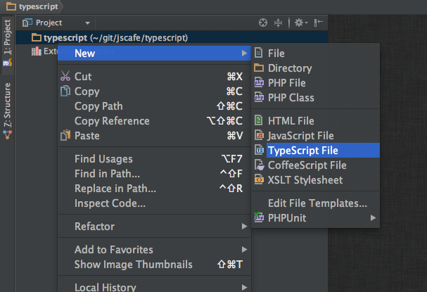

# メモ

* Microsoft が オープンソースとして公開している altJS の 型付け特化のコンパイラ
altJS: CoffeeScriptとか

* 現在 (2013-07-01の時点では) v0.9 

* 割と色んな所で名前を目にする事が多く、日本語の記事もそれなりにあります

## メリット

* CoffeeScript とは違い、普通の JavaScript の記述に近いので導入しやすい

* Visual Studio 2012 (+ TypeScript for Visual Studio 2012 アドオン) 
もしくは、JetBrains 社 の IDE WebStorm や PhpStorm でもそのまま使えます。

* CUI で作っている場合も nodejs があれば大丈夫。
Grunt 使ってる人は 

* CoffeeScript の出力した 生js ファイル汚くありませんか？ TypeScript はそんなことはありません。 

* 有名なJavaScriptライブラリ の 宣言ファイル沢山あります!

[https://github.com/borisyankov/DefinitelyTyped](https://github.com/borisyankov/DefinitelyTyped)

## デメリット

* コードが冗長になりやすい

* JavaScript フレームワーク や、今まで作ったコード資産を導入するには手間がかかる =>
既存のコードは書き直してまで移行しなくても良い場面の方が多いと思います。

* 元のコードが CoffeeScript なんだけど... 諦めましょう

	npm install -g typescript

## CUI options

	Version 0.9.0.1
	Syntax:   tsc [options] [file ..]

	Examples: tsc hello.ts
			  tsc --out foo.js foo.ts
			  tsc @args.txt

	Options:
	  -c, --comments              Emit comments to output
	*  -d, --declaration           Generates corresponding .d.ts file
	*  -b, --disallowbool          Throw error for use of deprecated "bool" type
	*  -m, --disallowimportmodule  Throw error for use of deprecated "module" keyword when referencing an external module. Only allow "require" keyword.
	  -e, --exec                  Execute the script after compilation
	  -h, --help                  Print this message
	  --module KIND               Specify module code generation: "commonjs" (default) or "amd"
	  --nolib                     Do not include a default lib.d.ts with global declarations
	  --out FILE|DIRECTORY        Concatenate and emit output to single file | Redirect output structure to the directory
	  --sourcemap                 Generates corresponding .map file
	  --target VER                Specify ECMAScript target version: "ES3" (default), or "ES5"
	  -v, --version               Print the compiler's version: 0.9.0.1
	  -w, --watch                 Watch input files
	  @<file>                     Insert command line options and files from a file.

## キャプチャ

## サンプルファイル 構成

	.
	└── hello
	     ├── hello.d.ts
	     ├── hello.js
	     ├── hello.js.map
	     └── hello.ts

## 参考

* Welcome to TypeScript

[http://www.typescriptlang.org/](http://www.typescriptlang.org/)
[https://npmjs.org/package/typescript](https://npmjs.org/package/typescript)

* WEB+DB PRESS Vol.75 に TypeScript の記事載ってます

[http://gihyo.jp/magazine/wdpress/archive/2013/vol75](http://gihyo.jp/magazine/wdpress/archive/2013/vol75)

* TypeScript + SourceMap でデバッグしてみる

[http://yaakaito.org/blog/2013/03/28/typescript-with-sorucemap/](http://yaakaito.org/blog/2013/03/28/typescript-with-sorucemap/)

* TypeScriptのAPIドキュメントをyuidocjsで自動生成

[http://straitwalk.hatenablog.com/entry/2013/06/22/022909](http://straitwalk.hatenablog.com/entry/2013/06/22/022909)

* borisyankov/DefinitelyTyped

[https://github.com/borisyankov/DefinitelyTyped](https://github.com/borisyankov/DefinitelyTyped)

